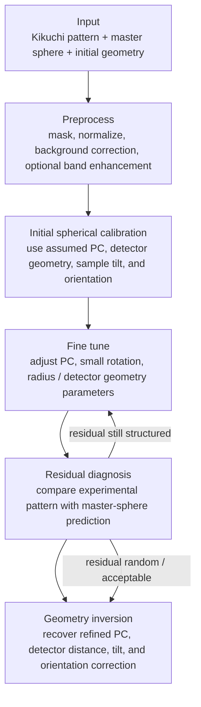
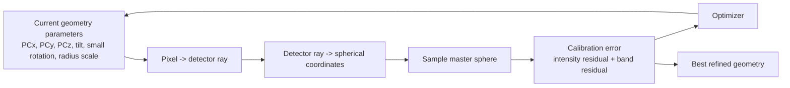
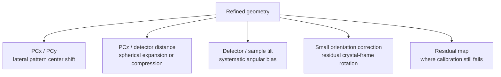

# Spherical Kikuchi Calibration Pipeline

This is the simplified conceptual pipeline. The goal is not to show every
script output, but to show the main physical calibration logic.

## Publication Figure

Use `make_physical_spherical_pipeline_figure.py` to generate a publication-style
physics schematic:

```powershell
python .\make_physical_spherical_pipeline_figure.py
```

The generated files are:

- `outputs/article_figures/spherical_calibration_pipeline/physical_spherical_calibration_pipeline.svg`
- `outputs/article_figures/spherical_calibration_pipeline/physical_spherical_calibration_pipeline.pdf`
- `outputs/article_figures/spherical_calibration_pipeline/physical_spherical_calibration_pipeline.png`

## Main Idea



## Fine-Tune Core



## Parameter Meaning



## Short Interpretation

- Preprocessing only makes the pattern comparable to the master sphere; it does
  not change the physical geometry.
- Initial spherical calibration is the first physics-based mapping from detector
  pixels to the Kikuchi sphere.
- Fine tune should be bounded and low-dimensional, otherwise it becomes image
  registration rather than EBSD geometry calibration.
- Residual diagnosis decides which parameter should be released next.
- The final result can be interpreted as inverted geometry: refined PC,
  detector distance, tilt bias, and orientation correction.
